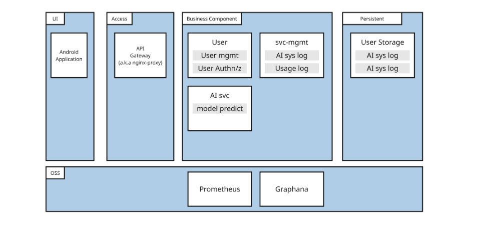

# 👁️ EYEPATH: AI-Powered Visual Assistance System for the Visually Impaired

> **Project**: Embedded System Course, Department of Mobile System Engineering, Dankook University  
> **Contributors**: Kim Woosung, Lee Youngjoo, Lim Seokbeom  
> **GitHub Organization**: [github.com/EYEPATH-EMBEDDED](https://github.com/EYEPATH-EMBEDDED)

---

## 🚀 Project Overview

**EYEPATH** is an AI-driven assistive mobility system designed to enhance safety for visually impaired users by providing **real-time collision risk predictions**. Using smartphone camera feeds, the system employs **YOLOv11** for object detection and **Conv-LSTM** for temporal motion prediction to detect potential collisions 2–5 seconds in advance. Feedback is delivered through vibrations, audio alerts, and notifications on an Android app.

The system is built as a modular microservice architecture, ensuring scalability, fault tolerance, and low-latency performance (~21ms per frame) on mobile devices.

---

## 🎯 Objective

Traditional assistive tools like white canes and guide dogs lack proactive detection of dynamic obstacles. EYEPATH addresses this by integrating advanced AI models to anticipate collisions, enabling timely warnings for visually impaired users. The system is optimized for energy efficiency and real-time operation on Android smartphones.

---

## 🧩 System Components

EYEPATH comprises five key modules:

1. **EYEPATH-APP**: Android app for user interaction, camera streaming, and feedback delivery.
2. **ARGUS**: WebSocket-based AI inference server for real-time collision prediction.
3. **Tablula**: Spring Boot backend for authentication and user profile management.
4. **Fiscus**: Go-based usage logging service for session data and statistics.
5. **AI Model**: Core pipeline combining YOLOv11 and Conv-LSTM for collision risk prediction.

---

## 🏗️ System Architecture



EYEPATH operates in a **five-layered architecture**:

1. **UI Layer (Android App)**: Streams camera frames, displays user info, and provides feedback.
2. **Access Layer**: Nginx API Gateway for routing, TLS termination, CORS, and rate-limiting.
3. **Business Logic**:
    - **Tablula**: User authentication and profile management.
    - **Argus**: AI inference with YOLOv11 and Conv-LSTM.
    - **Fiscus**: Session logging and usage statistics.
    - **svc-mgmt**: Monitors FPS, GPU utilization, and memory.
4. **Persistence Layer**: MongoDB (Tablula) and SQLite/MySQL (Fiscus) for data storage.
5. **Observability Layer**: Prometheus and Grafana for real-time monitoring.

---

## ⚙️ Technology Stack

### EYEPATH-APP (Android Client)
- **Languages**: Kotlin, Java
- **Libraries**: Jetpack CameraX, OkHttp (REST + WebSocket)
- **Tools**: Gradle 8.11.1, Android SDK 35 (minSdk 24)

### ARGUS (AI Inference Server)
- **Languages**: Python 3.10+
- **Frameworks**: FastAPI, Uvicorn, WebSocket
- **AI Libraries**: PyTorch, Torchvision, Ultralytics YOLOv11, OpenCV
- **GPU Acceleration**: CUDA 12.1, torch==2.3.0, torchvision==0.18.0

### Tablula (Authentication Server)
- **Languages**: Java 17
- **Frameworks**: Spring Boot 3.4.5, Spring Security
- **Database**: MongoDB
- **Security**: JWT (Access/Refresh Tokens)
- **Deployment**: Docker, Kubernetes

### Fiscus (Usage Logging)
- **Languages**: Go 1.24.4
- **Frameworks**: Gin (HTTP server)
- **Databases**: SQLite (default), MySQL (optional)
- **Security**: JWT-based authentication

### AI Model
- **Object Detection**: YOLOv11n (12MB, 15ms latency)
- **Temporal Modeling**: Conv1D + Bi-LSTM + Attention + Softmax
- **Datasets**:
    - AI-Hub Pedestrian Dataset (352k frames)
    - MiDaS Depth Maps (170k images)
    - Custom Collision Simulation (230k frames)

---

## 🧠 AI Pipeline

The AI pipeline processes camera frames in real time:

1. **Input**: 416×416 JPEG frames (quality ≤ 0.6) from the Android app via WebSocket.
2. **Object Detection (YOLOv11n)**:
    - Detects obstacles (e.g., people, vehicles, walls).
    - Outputs bounding boxes, class IDs, and confidence scores.
    - Latency: ~15ms.
3. **Feature Extraction**:
    - Computes IoU between objects and a dynamic collision zone (based on user height, shoulder width, and camera FOV).
    - Feature vector: `[timestamp, x1, y1, x2, y2, overlap_ratio, frame_ratio]`.
4. **Temporal Modeling**:
    - Features stored in a `SlidingQueue` (1200 frames, ~4–6 seconds).
    - Conv1D + Bi-LSTM outputs collision probability `[P(no collision), P(collision)]`.
    - Latency: ~6ms.
5. **Output**: Binary result (`0`: no risk, `1`: collision risk) sent to the client within **~21ms**.

### Performance Metrics
| Model/Input   | Accuracy | Precision | Recall | F1-Score | Latency |
|---------------|----------|-----------|--------|----------|---------|
| YOLO11n       | 0.74     | -         | -      | 0.78     | 15ms    |
| + IoU Change  | 0.87     | 0.82      | 0.84   | 0.83     | 6ms     |
| + Depth       | 0.90     | 0.87      | 0.86   | 0.86     | 200ms (rejected) |

**Final Model**: YOLO11n + Conv1D + Bi-LSTM achieves an **F1-Score of 0.83** with **21ms latency**.

---

## 🔌 API Specifications

### Tablula (Authentication & Profile)
| Method | Endpoint                | Description                     |
|--------|-------------------------|---------------------------------|
| `POST` | `/users`                | Register new user               |
| `POST` | `/auth/login`           | Issue JWT tokens                |
| `POST` | `/auth/logout`          | Invalidate refresh token        |
| `POST` | `/auth/reissue`         | Reissue access token            |
| `PUT`  | `/users`                | Update user profile             |
| `GET`  | `/users`                | Retrieve user info              |
| `GET`  | `/usage/{userId}`       | Fetch usage stats               |

### Argus (AI Inference)
| Protocol   | Endpoint                              | Description                     |
|------------|---------------------------------------|---------------------------------|
| WebSocket  | `/ws/collision?token={JWT}`           | Real-time collision prediction  |

**Client-to-Server Message**:
```json
{ "type": "image", "data": "<base64 JPEG image>" }
```

**Server-to-Client Response**:
```json
{ "type": "result", "result": 0 }
```

### Fiscus (Usage Logging)
| Method | Endpoint                | Description                     |
|--------|-------------------------|---------------------------------|
| `POST` | `/logs`                 | Save session usage logs         |
| `GET`  | `/usage/:userId`        | Retrieve monthly usage summary  |

**POST /logs Request**:
```json
{
  "user_id": "andylim1022",
  "start_time": "2025-06-10 13:00:00",
  "end_time": "2025-06-10 13:30:00",
  "photos": 5
}
```

**GET /usage/:userId Response**:
```json
{
  "user_id": "andylim1022",
  "year": 2025,
  "month": 6,
  "used_minutes": 120,
  "photo_count": 423423
}
```

---

## 🔐 Authentication Flow

1. **Login**: Client sends credentials to `/auth/login` (Tablula), receiving an `accessToken` (header) and `refreshToken` (HTTP-only cookie).
2. **Authenticated Requests**: Include `Authorization: Bearer <accessToken>` header.
3. **Token Renewal**: If `accessToken` expires, `/auth/reissue` uses `refreshToken` to issue a new token.
4. **AI Inference**: Argus validates JWT via Tablula before upgrading WebSocket connections.
5. **Logout**: `/auth/logout` invalidates `refreshToken` and clears cookies.

---

## 📂 Repository Structure

### EYEPATH-APP
```
EYEPATH_APP/
├── app/src/main/java/dku/mse/eyepath/
│   ├── LoginActivity.java
│   ├── DashboardActivity.java
│   ├── WebsocketAIActivity.java
│   ├── ProfileActivity.java
├── res/layout/ (UI XML)
├── build.gradle.kts
```

### ARGUS
```
argus/
├── main.py
├── ai_session/
├── collision_predictor/
├── temp_demo/
├── assets/ (model checkpoints, configs)
├── requirements.txt
├── .env
```

### Tablula
```
tablula/src/
├── controller/auth/ (login, logout)
├── controller/signup/
├── controller/userinfo/
├── security/ (JWT handling)
├── service/ (business logic)
├── domain/ (MongoDB entities)
├── repository/ (Mongo repositories)
├── application.yml
```

### Fiscus
```
fiscus/
├── cmd/
│   ├── main.go
│   ├── api.go
│   ├── driver.go
│   ├── usage_log.go
├── scripts/init_db.sh
├── go.mod
```

### AI Model
```
eyepath_train/
├── collision_predict/
│   ├── train.py
│   ├── preprocess.py
│   ├── model_depth_conv3d.py
│   ├── stat_test/
├── depth_predict/
│   ├── train.py
│   ├── models/
├── object_detect/
│   ├── Bbox_train.py
│   ├── Surface_train.py
```

---

## 🛠️ Setup & Running

### EYEPATH-APP
```bash
git clone https://github.com/EYEPATH-EMBEDDED/EYEPATH_APP.git
cd EYEPATH_APP
./gradlew assembleDebug
```
Run via Android Studio on a device.

### ARGUS
```bash
git clone https://github.com/EYEPATH-EMBEDDED/argus.git
cd argus
pip install -r requirements.txt
uvicorn main:app --host 0.0.0.0 --port 8000
```

### Tablula
```bash
git clone https://github.com/EYEPATH-EMBEDDED/tablula.git
cd tablula
./gradlew build
java -jar build/libs/SNAPSHOT.jar
```
**Docker**:
```bash
docker build -t tablula .
docker run -p 8080:8080 tablula
```

### Fiscus
```bash
git clone https://github.com/EYEPATH-EMBEDDED/fiscus.git
cd fiscus
go mod tidy
go run cmd/main.go
```

### AI Demo
```bash
git clone https://github.com/EYEPATH-EMBEDDED/AI.git
cd AI
pip install -r requirements.txt
cp your_last.pt assets/last11.pt
python run_demo.py src/videos/example.mp4 -o result.mp4
```

---

## 📊 Datasets

1. **AI-Hub Pedestrian Dataset**: 352k frames, 29 classes (people, vehicles, signage).
2. **MiDaS Depth Maps**: 170k images for depth estimation.
3. **Collision Simulation Dataset**: 230k frames, 28.9% collision, 71.1% non-collision.
4. **Segmentation Masks**: Pixel-level annotations for ground-based hazards.

---

## 📈 Performance Evaluation

- **Latency**: End-to-end latency of ~21ms (YOLO11n: 15ms, Conv-LSTM: 6ms).
- **Accuracy**: F1-Score of 0.83 with IoU change features.
- **Validation**: Mann-Whitney U-test confirms IoU correlation with collisions (p < 0.001).


---

## 🔗 Related Repositories

| Component         | Repository URL                                      |
|-------------------|----------------------------------------------------|
| Android App       | https://github.com/EYEPATH-EMBEDDED/EYEPATH-APP.git |
| AI Inference      | https://github.com/EYEPATH-EMBEDDED/argus.git       |
| Authentication    | https://github.com/EYEPATH-EMBEDDED/tablula.git     |
| Usage Logging     | https://github.com/EYEPATH-EMBEDDED/fiscus.git      |
| AI Model          | https://github.com/EYEPATH-EMBEDDED/AI.git          |

---

## 📜 License

Licensed under [Apache License 2.0](LICENSE).

---

## 👥 ContributorsLatency

- Kim Woosung
- Lee Youngjoo
- Lim Seokbeom  

> Dankook University  
> Department of Mobile System Engineering (Embedded Systems)
